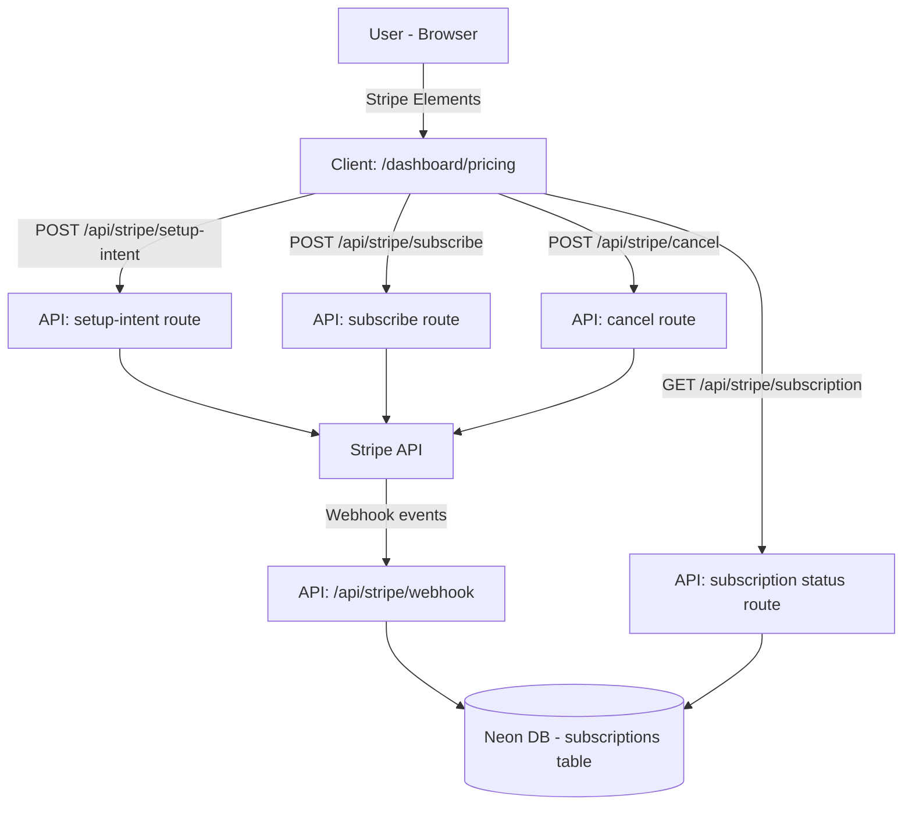

# Design Document: Stripe Subscription Billing

## Overview

This feature integrates Stripe subscription billing into the Shaji dashboard. Authenticated users will see a "Pricing" link in the dashboard sidebar. Clicking it opens a dashboard-internal pricing page where they can subscribe to a plan by entering card details via Stripe Elements. Stripe handles automatic monthly billing in USD. Webhooks keep the database in sync with Stripe's subscription state.

---

## Architecture



All Stripe secret key usage is confined to Next.js API route handlers (server-side). The client only receives publishable key and client secrets.

---

## Components and Interfaces

### New Files

| File | Purpose |
|---|---|
| `app/dashboard/pricing/page.tsx` | Dashboard-internal pricing page |
| `app/api/stripe/setup-intent/route.ts` | Creates a Stripe SetupIntent |
| `app/api/stripe/subscribe/route.ts` | Creates Stripe Customer + Subscription |
| `app/api/stripe/cancel/route.ts` | Cancels active subscription |
| `app/api/stripe/subscription/route.ts` | Returns current subscription status |
| `app/api/stripe/webhook/route.ts` | Handles Stripe webhook events |
| `lib/stripe.ts` | Stripe server-side singleton |
| `scripts/007_create_subscriptions_table.sql` | DB migration for subscriptions |

### Modified Files

| File | Change |
|---|---|
| `components/dashboard-sidebar.tsx` | Add "Pricing" nav item |
| `.env.local` | Add Stripe keys |

### Client Component: `SubscribeForm`

Embedded inside `app/dashboard/pricing/page.tsx`. Uses `@stripe/react-stripe-js` and `@stripe/stripe-js`.

```
Props: { planId: string, planName: string, priceId: string, onSuccess: () => void }
State: loading, error, clientSecret
Flow:
  1. On mount: POST /api/stripe/setup-intent → get clientSecret
  2. Render <CardElement> from Stripe Elements
  3. On submit: stripe.confirmCardSetup(clientSecret)
  4. On success: POST /api/stripe/subscribe { paymentMethodId, priceId }
  5. Call onSuccess() to refresh subscription status
```

---

## Data Models

### Environment Variables (`.env.local`)

```
STRIPE_SECRET_KEY=sk_...
STRIPE_WEBHOOK_SECRET=whsec_...
NEXT_PUBLIC_STRIPE_PUBLISHABLE_KEY=pk_...
```

### Stripe Products / Prices

Two Stripe Price IDs must be created in the Stripe dashboard (or via CLI) with `billing_scheme=per_unit`, `recurring.interval=month`, `currency=usd`, and `billing_cycle_anchor` behavior set to bill at end of month.

| Plan | Amount | Stripe Price ID env var |
|---|---|---|
| Starters Pack | $199.99/month | `STRIPE_PRICE_STARTERS` |
| Professional | $499.99/month | `STRIPE_PRICE_PROFESSIONAL` |

### Database: `subscriptions` table

```sql
CREATE TABLE subscriptions (
  id SERIAL PRIMARY KEY,
  user_id INTEGER NOT NULL REFERENCES users(id),
  stripe_customer_id TEXT NOT NULL,
  stripe_subscription_id TEXT,
  stripe_price_id TEXT,
  plan_name TEXT,
  status TEXT NOT NULL DEFAULT 'none',  -- none | active | past_due | canceled
  current_period_end TIMESTAMPTZ,
  created_at TIMESTAMPTZ DEFAULT NOW(),
  updated_at TIMESTAMPTZ DEFAULT NOW()
);
```

### API Contracts

**POST `/api/stripe/setup-intent`**
- Body: `{ walletAddress: string }`
- Response: `{ clientSecret: string }`

**POST `/api/stripe/subscribe`**
- Body: `{ walletAddress: string, paymentMethodId: string, priceId: string, planName: string }`
- Response: `{ subscriptionId: string, status: string }`

**POST `/api/stripe/cancel`**
- Body: `{ walletAddress: string }`
- Response: `{ status: string }`

**GET `/api/stripe/subscription?walletAddress=...`**
- Response: `{ status: string, planName: string | null, currentPeriodEnd: string | null }`

**POST `/api/stripe/webhook`**
- Stripe-signed webhook payload
- Handles: `invoice.payment_succeeded`, `invoice.payment_failed`, `customer.subscription.deleted`

---

## Correctness Properties

*A property is a characteristic or behavior that should hold true across all valid executions of a system-essentially, a formal statement about what the system should do. Properties serve as the bridge between human-readable specifications and machine-verifiable correctness guarantees.*

Property 1: Subscription status reflects Stripe webhook events
*For any* subscription record in the database, after processing an `invoice.payment_succeeded` webhook the status SHALL be `active`, and after processing an `invoice.payment_failed` webhook the status SHALL be `past_due`.
**Validates: Requirements 4.2, 4.3, 4.4, 4.5**

Property 2: Cancel sets status to canceled
*For any* active subscription, calling the cancel API and processing the resulting `customer.subscription.deleted` webhook SHALL result in the subscription status being `canceled` in the database.
**Validates: Requirements 5.2**

Property 3: Server-side secret key isolation
*For any* client-side bundle, the Stripe secret key SHALL not appear in the compiled output — only the publishable key is present client-side.
**Validates: Requirements 6.2**

Property 4: Webhook signature validation rejects tampered payloads
*For any* webhook request with an invalid or missing Stripe signature, the webhook handler SHALL return a 400 response and SHALL not mutate the database.
**Validates: Requirements 6.3**

Property 5: SetupIntent creation is idempotent per user
*For any* user, calling the setup-intent endpoint multiple times SHALL reuse the existing Stripe Customer rather than creating duplicate customers.
**Validates: Requirements 3.2**

---

## Error Handling

| Scenario | Behavior |
|---|---|
| Card confirmation fails (Stripe error) | Display Stripe's `error.message` in the form; do not close the modal |
| Webhook signature invalid | Return HTTP 400; log the attempt; no DB write |
| Stripe API unreachable | Return HTTP 502 from API route; surface generic error to client |
| User has no wallet address | API routes return HTTP 400 with descriptive message |
| Subscription already active on subscribe | Return HTTP 409; client shows "already subscribed" message |

---

## Testing Strategy

### Property-Based Testing

Library: **fast-check** (TypeScript-native, works in Node/Jest/Vitest without browser).

Each property-based test runs a minimum of 100 iterations. Tests are tagged with the property they implement.

- Property 1: Generate arbitrary webhook payloads for `invoice.payment_succeeded` and `invoice.payment_failed`, run the webhook handler logic, assert DB status matches expected value.
- Property 2: Generate arbitrary subscription records, call cancel logic, assert status is `canceled`.
- Property 4: Generate arbitrary request bodies with random/missing signatures, assert handler returns 400 and does not write to DB.
- Property 5: Generate arbitrary wallet addresses, call setup-intent multiple times, assert only one Stripe Customer exists per wallet.

### Unit Tests

- `lib/stripe.ts` singleton initializes correctly with env var.
- API route handlers return correct HTTP status codes for missing/invalid inputs.
- Sidebar renders "Pricing" link when user is authenticated.
- Dashboard pricing page shows correct plan details and active plan indicator.

### Integration Notes

- Stripe webhook testing locally: use `stripe listen --forward-to localhost:3000/api/stripe/webhook`.
- Test card: `4242 4242 4242 4242`, any future expiry, any CVC.
